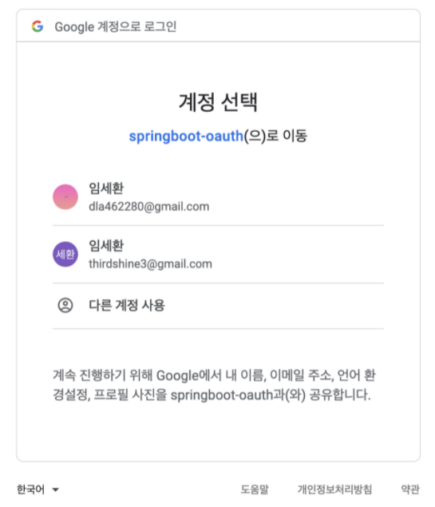

# 구글 로그인 세팅

- ## 구글 api console
    - 우선 google api console로 이동한다.
    - 프로젝트를 생성하고 프로젝트의 OAuth 동의 화면 , 사용자 인증 정보와 같은 기본정보를 입력한다.
    - [`http://localhost:8080/login/oauth2/code/google`](http://localhost:8080/login/oauth2/code/google) 승인된 리디렉션 URI에 해당 URI를 적어준다. login/oauth/code 까지는 고정이다. 뒤에 바뀌는 것에 따라 구글 , 페이스북 등으로 oauth 요청이 변경될 수 있다.
    - 해당 주소는 컨트롤러에서 따로 생성할 필요가 없다. 왜냐하면 서버에서 해당 로직을 처리하지 않기 때문이다.
    - 생성되는 클라이언트 ID와 클라이언트 비밀번호는 외부에 노출되지 않도록 보관하면 된다.
    - 보통은 JSON 파일로 다운로드하여 보관한다.
- ## OAuth 2.0
    - `implementation 'org.springframework.boot:spring-boot-starter-oauth2-client'` 그래들 속성 추가
    - `<a href="/oauth2/authorization/google">구글 로그인</a>` html 폼에 해당 버튼 추가~ 주소는 변경이 불가능하고 라이브러리를 추가하여 고정되는 주소이다.

        ```java
        .and()
        .oauth2Login()
        .loginPage("/loginForm");
        ```

      
